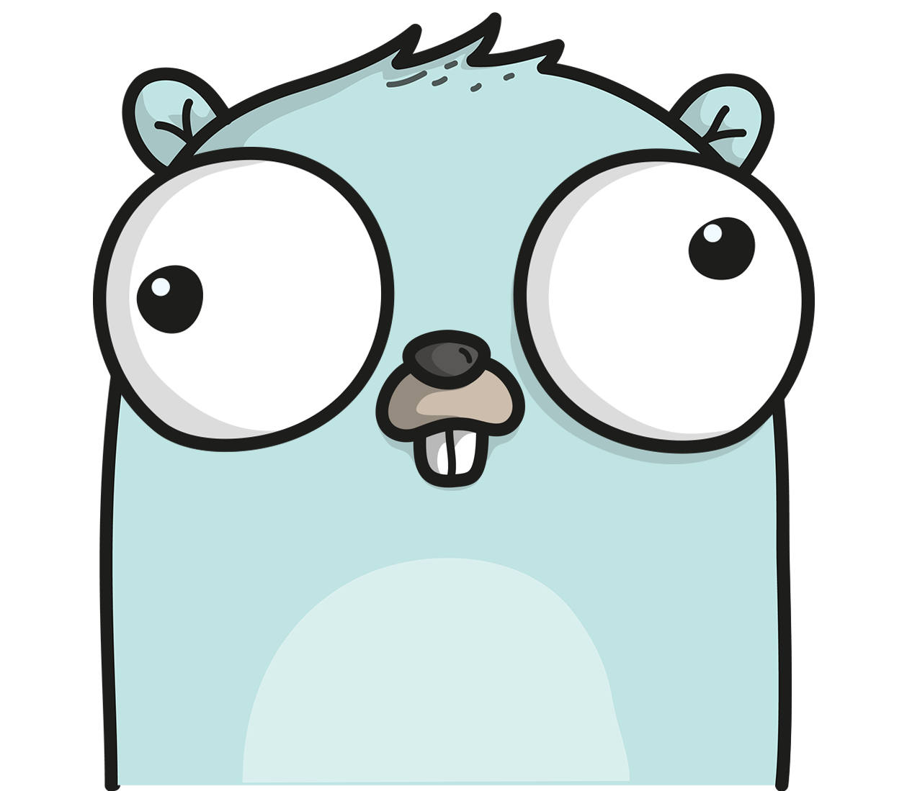
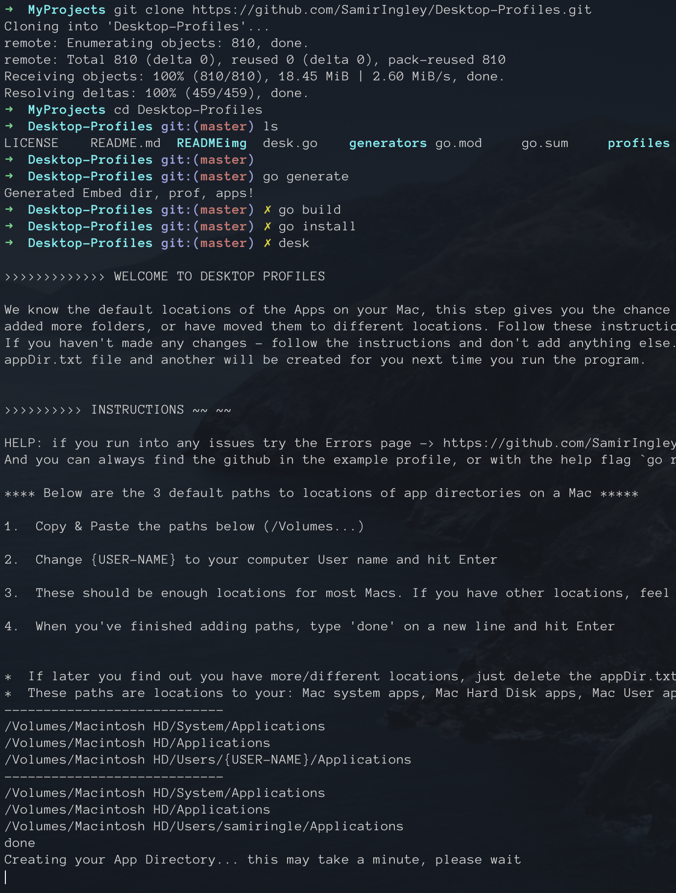

# Desktop Profiles 

  <a>
    <a href="https://goreportcard.com/badge/github.com/SamirIngley/Desktop-Profiles" />
    
     
  

## Status
Live and running smoothly :bike:

Demo: https://youtu.be/CynbOIZtDZo

*********************************************************************************************

### :anger: Problem
> I got tired of individually clicking through urls and apps to open what I need each time I switch to a new project or task. 
> I also did not want a cluttered desktop with everything open all the time, as this can be a large drain on the computer's resources and my attention span. 

### :potable_water: Solution
> With this command line tool, easily create and customize profiles (groups) of apps and/or urls and open any of these profiles with one short command.

### :green_apple: Example
1. Create a profile called "read"
2. Add the Books app, your Notes app, and Merriam-Webster's website
3. Anytime you want to read, open the "read" profile and voila, there they are, as you last left them!

************************************************************************************************

## Table of Contents
Built in Go on a :apple: Mac, for a Mac\
Works from *anywhere* :earth_africa: on your terminal 

**[:floppy_disk: Install](https://github.com/SamirIngley/Desktop-Profiles/blob/master/README.md#floppy_disk-install)\
[:mega: Commands](https://github.com/SamirIngley/Desktop-Profiles/blob/master/README.md#mega-commands)\
[:goal_net: Example](https://github.com/SamirIngley/Desktop-Profiles/blob/master/README.md#goal_net-example)**

**[:warning: Notes](https://github.com/SamirIngley/Desktop-Profiles/blob/master/README.md#warning-important-notes) \
[:boom: Errors](https://github.com/SamirIngley/Desktop-Profiles/blob/master/README.md#boom-errors)**

**[:inbox_tray: Contact Me](https://github.com/SamirIngley/Desktop-Profiles/blob/master/README.md#contact)**

### :arrow_up: Recent Updates
latest update: Sept 19, 2020
1) Added a shell script for easy install
2) Stored binary assets globally so program is functional anywhere on the cli

************************************************************************************************

# :floppy_disk: Install: 

First, you will need to install Go lang. (don't worry it's not hard and won't take long)

## Install Go and configure your GOPATH
* [Quick instructions](https://medium.com/@jimkang/install-go-on-mac-with-homebrew-5fa421fc55f5)
* [Detailed instructions](https://www.digitalocean.com/community/tutorial_series/how-to-install-and-set-up-a-local-programming-environment-for-go)

Then, follow the shell script installation steps below, and you're all set! 

## Shell Script:

Video walkthrough: https://youtu.be/c-Yz02v1Le0

### 1. Clone this repo and `cd` into it.
* `git clone https://github.com/SamirIngley/Desktop-Profiles.git`

### 2. In your terminal, run the command `bash script.sh`, this will have prompted you with instructions to enter your paths, do that now.
* You can find your username by typing the command `echo $USERNAME`
* Watch the video linked just above Step 1 if you're confused about entering your paths for this step 
* This will take a minute and you should receive a success message afterward saying your App Directory was created

### 3. Once you've done that, run the bash script `bash script.sh` one more time.
* This time, you should see the existing profiles listed, and if it's your first time - you'll see "example"
* :exclamation: If you are prompted again to enter your paths even after you already did it. Make sure you run the `bash script.sh` again in step 3. If you've already done that, this may be a rare bug that I haven't sorted out yet. Please delete this folder and try again - if you've installed Go and followed all the steps, it should work this time. :)

**SETUP COMPLETE, you're ready to roll!**
**For a full list of commands, checkout the Commands section below**
Don't forget to make sure your apps are spelled exactly as they're shown in your Applications folders

**Any trouble?** Refer to the [:boom: Errors](https://github.com/SamirIngley/Desktop-Profiles/blob/master/README.md#boom-errors)
 section and try the "Manual Install" process.

# :mega: Commands:

:bulb: Use multiple flags together for a better experience :)
:bulb: You can call commands from wherever you are in the terminal!

#### > List available profiles: `desk` 

#### > List input options: `desk -help`

#### > List profile contents: `desk -p {profile name} -l y` 

#### > Open a profile:  `desk -p {profile name}` 

#### > Add url(s): `desk -p {profile name} -a url`
Enter the url, and hit Enter after each one, type "done" when you've finished.

#### > Add app(s): `desk -p {profile name} -a app`
Enter the exact app name (ei: VS Code won't work but Visual Studio Code will), and hit Enter after each one, type "done" when you've finished.

#### > Create a profile (or add to an existing profile):  `desk -p {profile name} -a app`
Type the name of the profile you want to create and the app or url you'd like to add. Replace `app` with `url` if you want to add urls. Add each app or url, hit Enter after typing each one, then type `done` and hit Enter when you're finished.

#### > Delete from profile:  `desk -p {profile name} -d url`
(Same as adding except use -d instead of -a) or `go run desk.go -p profile-name -d url`. Replace `url` with `app` if you want to add apps. Add each app or url, hit Enter after typing each one, then type `done` and hit Enter when you're finished.

#### > Delete profile:  `desk -p {profile name} -d profile` 
or `go run desk.go -p profile-name -d profile-name` (after -d write "profile" or the name of the profile)

# :goal_net: Example:

An example profile has been provided in the profiles/ folder.
All your profiles can be found in this folder as well. 

To run the example, type:
`go run desk.go -p example`

### To add an app (Slack) to the example, type:
`desk -p example -a app`
Then type:
`Slack`
And hit Enter.

Type the names of any other apps you'd like in this profile and hit Enter after each one. 

Then type:
`done`
and hit Enter when you've finished. 

You should see a message saying you added an app to your profile.
To verify what was added, type:
`desk -p example -l y` 
and a list should show up of the contents of the example profile.

### To add a website (Google) to the example, type:
`desk -p example -a url`
and hit Enter.

Now, type:
`google.com`
And hit Enter.

You've now added "google.com" to the profile example.
Type the name of any other websites you'd like and hit enter after each one. 

And finally:
`done`
when you're finished. 

You should see a message saying you added a url(s) to your profile.
To verify what was added, type:
`desk -p example -l y` 
and a list should show up of the contents of the example profile.

### To delete an app or url, do the same as above for adding, except use the `-d` flag instead of `-a`

### To delete a profile:
`desk -p profile-name -d profile`

You should get a confirmation message asking if you're sure you want to delete the profile. 

## :warning: Important Notes:

### Input: 

* No trailing spaces when adding or deleting apps. Must be typed exactly as is in the appDir.txt

* Type anything for yes, type "no" for no, more details can be found about the input by typing the "-help" flag: `desk -help` (Exception: for -d flag when deleting a profile -> must be the profile name or the word "profile")

* Currently case sensitive - apps must be typed exactly as shown on your pc

* If you're having trouble specifying an app, find it in the appDir.txt file (which is created when you first run `go run desk.go`) and ignore the number in front of it")

### APP DIRECTORY:

* If you added more new apps to your pc, just delete the appDir.txt and .env files and a new ones will be created for you next time you run the program.
* Same applies if you want to add new paths to other Application folders

## Future updates:
- open specific "file" with "app" 
- needs to handle trailing space when deleting apps
- need to be able to close apps and urls too
- DRY for reading profile
- instead of appending to profile, look for blank line!

## :boom: Errors

If you run into ANY problems with opening apps, you've downloaded new apps, added incorrect paths while setting up, or you move your folder:

- First see if you typed the name of the Application correctly - remember shorthand names are not recognized. For example "VS Code" is not recognized, but "Visual Studio Code" is recognized. Also "Zoom" might be "zoom.us" on your computer. Check your Applications folder
- Next try to find the app in the "appDir.txt" file (ignore the number in front of it). Use `Cmd` + `f` to search for it. This file is a collection of all the apps at all the paths you passed in. If it's not there, then you likely haven't passed the path to that app during setup and need to redo this step - see next step for instructions on how to do this. Your profiles will still exist afterwards.

**To Redo Setup:** It's going to easier to delete the whole folder and go through the installation again, save your profile folder if you want to keep your profiles 

From there you'll be prompted to set up your application paths again :) follow the pictures carefully and add any additional paths you want to. 

**desk command back to WELCOME**
* If you are prompted to re enter the paths - you may have missed a step. Try typing `Ctrl` + `c` to exit and check the steps, or redo setup. 
* Then try running `desk` again and it should work now. If it doesn't, [hit my line - let me know](https://github.com/SamirIngley/Desktop-Profiles/blob/master/README.md#contact)

If you're having issues with the binary file:
- Try typing `go run desk.go` everywhere instead of `desk` 

#### Manual Install:

Try these steps if the Shell Script steps do not work. 

1. Clone this repo to a location you want.
* `git clone https://github.com/SamirIngley/Desktop-Profiles.git`
* :non-potable_water: You will run into issues if you move this folder after completing step 3. However, you won't ever need to access this folder. If you do move the folder after this step refer to [:boom: Errors](https://github.com/SamirIngley/Desktop-Profiles/blob/master/README.md#boom-errors)

2. `cd` into it. 

3. Run `go generate`, then `go build`, next `go install`, and `desk`. We repeat these commands in the last step.

* go generate: You should see a success message. This stores your directory paths globally so we can access this program globally

* go build: This will create a binary file (executable) called desk. 

* go install: This will install it for you to use globally!

* desk: This will walk you through creating your app directory file. Follow the image and steps below. 

* 3 of the most common paths for locations of Applications on Mac are shown there at the bottom between the short lines, like in the picture, copy and paste those -> don't forget to change {USER-NAME} to your computer user name, then type `done`

4. Last, repeat step 3 after you successfully created the app directory - and you're done!  

* If you type in `desk` you should see the "example" profile. Try opening it with `desk -p example` or make your own using the other commands in the section below

This was built on a Mac and for a Mac. 

Feel free to reach out to me if you run into any issues: samir.ingle7@gmail.com

## Contact:
* samir.ingle7@gmail.com
* https://www.samiringle.com

:coffee: Buy Me a Coffee! :smile:
Venmo @SamirIngle

### Acknowledgements:
 

Open functionality help from:
https://github.com/skratchdot/open-golang

go doc
https://make-school-courses.github.io/BEW-2.5-Strongly-Typed-Languages/#/Lessons/DocsDeploy
